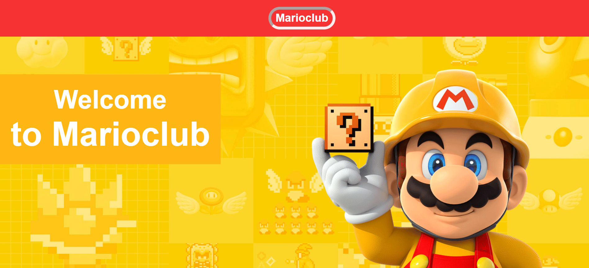
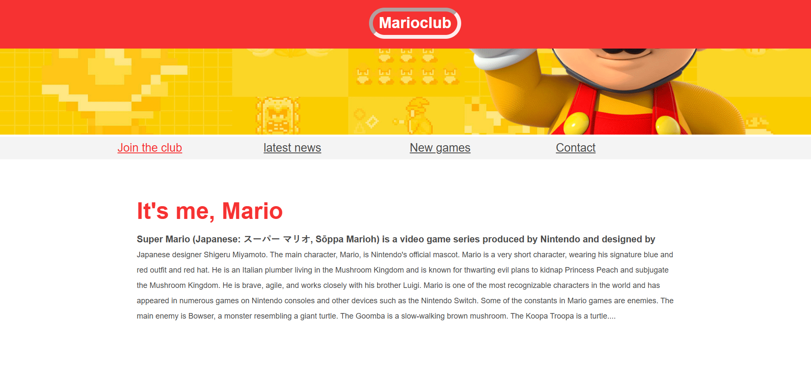
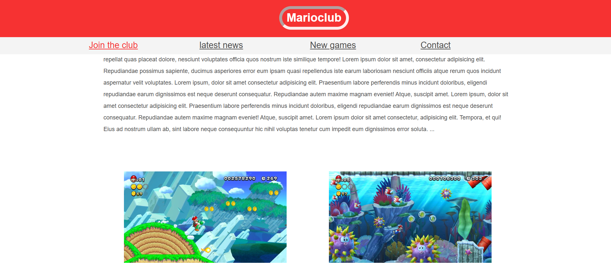
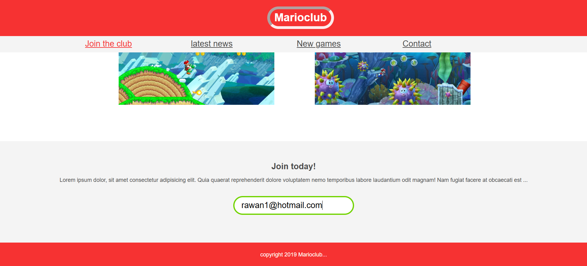

# Marioclub Website 🎮

This is a simple **HTML & CSS** project that showcases a Mario-themed website.

## 📌 Features
- Responsive design with a welcome banner.
- Navigation menu: Join, News, Games, Contact.
- Article section introducing Mario.
- Image gallery with thumbnails.
- **Email input field with validation:**
  - Border turns **green** ✅ when the email format is correct.
  - Border turns **red** ❌ when the email format is invalid.
- Footer with copyright.

## 🛠️ Built With
- **HTML5**
- **CSS3**

## 🖼️ Project Images

